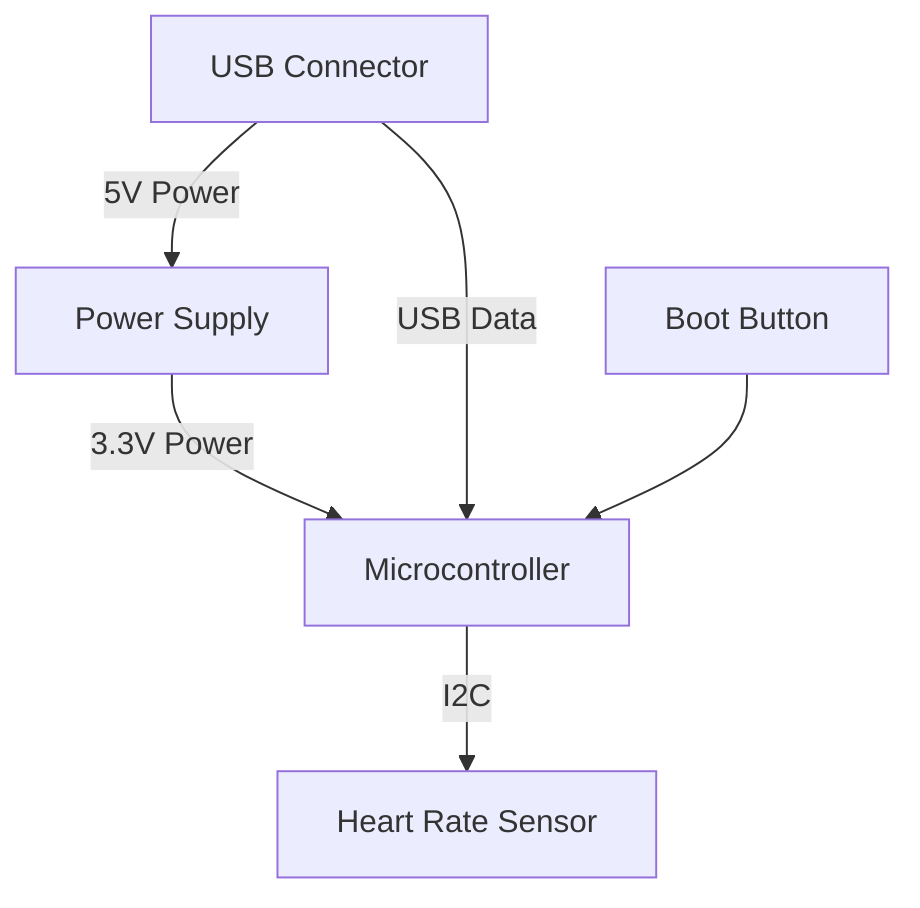

# Description

The Demo project is a compact electronic device featuring a heart rate sensor connected to an RP2040 microcontroller. It includes a USB Type-C connector for power and communication, along with a 3.3V power supply system. The device is designed for biometric monitoring applications with a simple and modular architecture.

# Features

- RP2040 microcontroller for processing and control
- MAX30102 heart rate and pulse oximeter sensor
- USB Type-C connectivity for power and data
- 3.3V regulated power supply (RT9013-33GB)
- I2C communication between microcontroller and sensor
- Tactile boot button (KMR211NGLFS)
- Modular design with clear separation of functions

# Applications

- Wearable health monitoring devices
- Fitness trackers
- Medical monitoring equipment
- Educational electronics projects
- IoT health sensing nodes
- Biometric authentication systems

## Specifications

### System Components

| Component     | Description                                | Function             |
| ------------- | ------------------------------------------ | -------------------- |
| RP2040Kit     | Raspberry Pi RP2040 microcontroller module | Main processing unit |
| MAX30102EFD+T | Heart rate and pulse oximeter sensor       | Biometric sensing    |
| RT9013-33GB   | 3.3V linear voltage regulator              | Power management     |
| KH-TYPE-C-16P | USB Type-C connector                       | Power input and data |
| KMR211NGLFS   | Tactile switch                             | Boot mode selection  |

### Power Requirements

- Input voltage: 5V from USB
- Operating voltage: 3.3V (internally regulated)
- Power path: USB → 5V → 3.3V regulator → Microcontroller and sensors

### Communication Interfaces

- USB 2.0 for host communication
- I2C for sensor interface

### Pin Configuration and Functions

#### USB Connector Module

- USB 2.0 data interface
- 5V power output

#### Power Supply Module

- 5V input from USB
- 3.3V regulated output

#### Microcontroller Module

- 3.3V power input
- I2C master interface
- USB 2.0 device interface
- Boot button interface

#### Heart Rate Sensor Module

- I2C slave interface
- Integrated biometric sensing

## Detailed Description

### Overview

The Demo project demonstrates a complete sensor-to-microcontroller system, organized into modular components that handle specific functions. The system architecture follows a clear hierarchical structure with the Demo module acting as the top-level container that instantiates and connects all submodules.

Power flows from the USB connector through a voltage regulator to supply the microcontroller and sensor components. Data flows through I2C from the heart rate sensor to the microcontroller, which can then communicate with a host device over USB.

### Functional Block Diagram

## Application and Implementation

### Application Information

The demo project serves as a reference design for biometric sensing applications. The MAX30102 sensor provides pulse oximetry and heart rate monitoring capabilities, while the RP2040 microcontroller handles data processing and communication with external devices.

### Typical Applications

1. **Health Monitoring Devices**: The system can be used in wearable devices that track heart rate and blood oxygen levels.
2. **Fitness Trackers**: Integrates with activity monitoring for comprehensive fitness data.

3. **Medical Devices**: Can be adapted for basic medical monitoring with appropriate software development.

4. **Educational Projects**: Demonstrates sensor integration, power management, and microcontroller programming.

### Design Requirements

- Power the system via USB Type-C connector
- Convert 5V to 3.3V for proper operation of components
- Establish I2C communication between RP2040 and MAX30102
- Provide a boot button for firmware updates

### Power Supply Recommendations

The power supply is based on the RT9013-33GB linear regulator, which provides a stable 3.3V output from the 5V USB input. For battery-powered applications, it's recommended to:

1. Add a battery management system
2. Consider a more efficient switching regulator
3. Implement power saving modes

### PCB Layout

- Keep I2C traces short and with consistent impedance
- Place decoupling capacitors close to power pins
- Ensure good thermal dissipation for the regulator
- Isolate analog and digital ground planes where appropriate
- Place the sensor away from heat-generating components

### Device and Documentation Support

- Reference the RP2040 datasheet for microcontroller details
- Consult the MAX30102 datasheet for sensor configuration
- Follow the RT9013-33GB datasheet for power supply design considerations
- Refer to USB Type-C specifications for connector implementation
