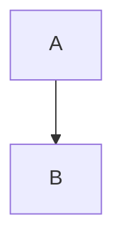

# Description

<!-- TODO: Replace with actual description, be accurate and verbose -->

# Features

<!-- TODO: Replace with actual features, be accurate and verbose  -->

# Applications

<!-- TODO: Replace with actual Application, be accurate and verbose  -->

## Specifications

<!-- TODO: Replace with actual specifications -->

### Pin Configuration and Functions

<!-- TODO: Replace with actual pin configuration and functions -->

### Absolute Maximum Ratings

<!-- TODO: Replace with actual absolute maximum ratings -->

## Detailed Description

### Overview

<!-- TODO: Replace with actual overview -->

### Functional Block Diagram

<!-- TODO: Replace with actual functional block diagram in mermaid format -->

## Application and Implementation

### Application Information

<!-- TODO: Replace with actual application information -->

### Typical Applications

<!-- TODO: Replace with actual typical applications -->

### Design Requirements

<!-- TODO: Replace with actual design requirements -->

### Power Supply Recommendations

<!-- TODO: Replace with actual power supply recommendations -->

### PCB Layout

<!-- TODO: Replace with actual PCB layout -->

### Device and Documentation Support

<!-- TODO: Replace with documentation support -->
